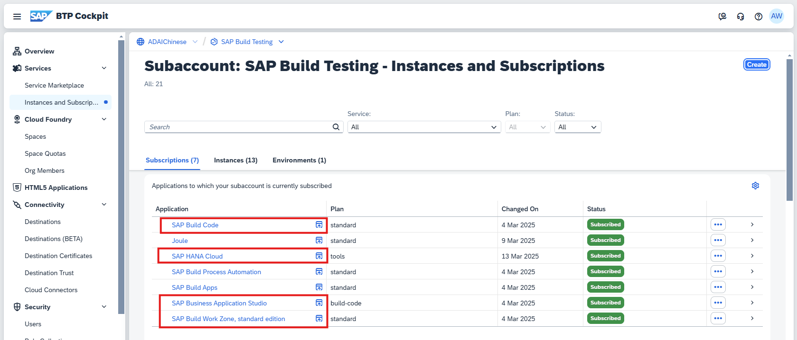
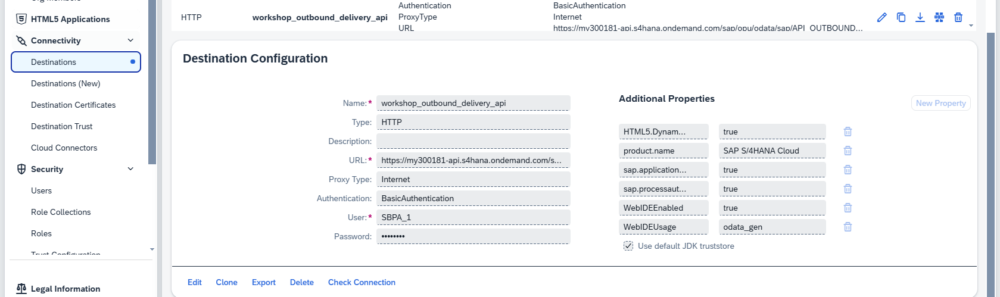
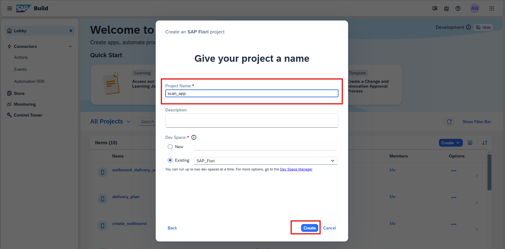

#   SAP Build Code Workshop

##  Scene 0 - Prerequisite

### 0.1 Check the Subscription
SAP Build Code  
SAP HANA Cloud  
SAP Business Applicaiton Studio  
SAP Build Work Zone, standard edition  



### 0.2 Define Destination in Sub Account for connection to S4

Similarly with WebIDE:


### 0.3 Postman may help with testing~

##  Scene 1 - Create Scan Page with UI5 Freestyle

### 1.0 Used Backend Service

>Mock MES system: Search Pick-PilletList-DNList with Pick Number
> 
> Http Method
> >Get
> 
> URL
> >https://pickMock-fantastic-platypus-sj.cfapps.us10-002.hana.ondemand.com/picks/{PickNumber}
> 
> Response
> >Response
> 


### 1.1 Create Project
 -> Enter SAP Build Lobby  
 -> Click Create  
 -> Build an Application -> SAP Build Code -> SAP Fiori Application


### 1.2 Insert External Service

### 1.3 Add new page for DN Details
```
/ui5-create-page Create new page called DN Detail with controller and routing. 
Create Text field for Devliery Document, Delivery Date, ship-to, and a table of DN's item with item and material column. 
Add a button in scanPage to navigate to DN page
```

### 1.4 Add field, table, button for scanPage
```
/ui5 Add a field called pick number in scanPage, and add a button called search next to it. 
In onSearch function,Use Ajax Call https://pickMock-fantastic-platypus-sj.cfapps.us10-002.hana.ondemand.com/picks/<pick_number>  with get method, Assign the result to json model curPick. 
The data model curPick is like this format: { "pickNumber":"2000100002", "palletList":[ {"palletID":"0000050004"} ], "DNList":[ {"DNNumber":"0080005223"} ] } 
Add a table called Pallet List binding with palletList in curPick model, showing the palletID for each row	
Add another table called Outbound Delivery binding with DNList in curPick model, showing the DNNumber in DNList

```

### 1.5 Add navigation to Detail Page
```
/ui5 Add the onNavRowToDetail function in scanPage controller, and bind it to the row in DNListTable. 
onNavRowToDetail will route to DNDetail Page with parameter DNNumber. 
Do not forget to update route in manifest.json

```

### 1.6 Add Odata Model binding in Detail Page
```
/ui5 In DNDetail Page, set page title to the DNNumber from parameter in oninit function. 
bind the view to the entity A_OutbDeliveryHeader with key DNNumber
Then, check metadata.xml  and manifest.json to bind corresponding  A_OutbDeliveryHeade's properties to the fields and table on the Detail Page
```

### 1.7 Add Scan button for Pick
```
/ui5 in scanPage, add a scan button between pick number field and search
use BarcodeScanner in on scan to trigger camera scan barcode, and write the decoded value to field picknumber, and trigger onSearch automatically
```

### 1.8 Add Scan button for Pallet
```
/ui5 add a status field (default value is pending) for each palletID in the curPick data model in onSearch Function
Add button scan Pallet in the header of pilletListTable
Use BarcodeScanner in onScanPilletPress to trigger camera scan barcode, if scanned pilletID in pilletList, change the pillet's status to released in data model curPick, otherwise, pop error "Scanned Pillet not in the list!"
```

### 1.9 Add PGI button and PGI service connecting S4
```
/ui5 add button PGI All DN in the header of outboundDeliveryTable
	
Add function onPGIAllDN to handle the button logic, this should trigger the function PostGoodsIssue with parameter DNNumber for all the DN in DNList, please check metadata.xml for function info

/ui5 in onPGIAllDN, getting error 403, I think it is due to csrf toke issue

/ui5 pgi get error 428 error, I think we should get etag before do PGI

/ui5 add a PGIAllFlag in curPick Model,
 default PGIAllFlag should be false, and switch to true after all the pallet released
pgi all dn button should be enabled based on this PGIAllFlag
 set pgi all button disabled while waiting for the backend response

```

### 1.10 Some extra logic
```
/ui5 add a showTableFlag to curPick model, 
pilletListTable and outboundDeliveryTable should be invisible before searching pick number
```

# Scan Barcode Link

# Appendix A - Related Tutorials
## ABAP Cloud Tutorial
### https://github.com/amritansh-sap/sap-build-abap-dev-workshop