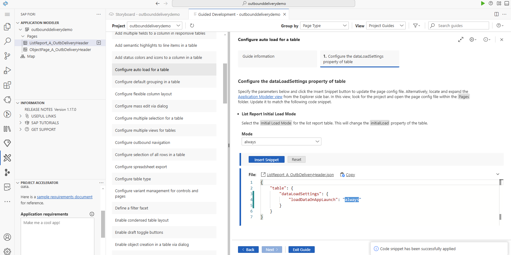

#   SAP Build Code Workshop

## Business Overview

#### Firstly, Scene 3 - Create Delivery Plan for create delivery note in batch
#### Secondly, Scene 2 - List Created Outbound Delivery
#### Thirdly, Scene 1 - Scan the barcode, trigger PGI for DN under specific picking number

##  Scene 0 - Prerequisite

### 0.1 Check the Subscription
SAP Build Code  
SAP HANA Cloud  
SAP Business Applicaiton Studio  
SAP Build Work Zone, standard edition  


### 0.2 HANA DN Instance Create and Configuration

Allow all IP

Use Default for other setting

### 0.3 Define Destination in Sub Account for connection to S4
Add following 2 destination, password will be provided in chat.

[workshop_outbound_delivery_api](destination%2Fworkshop_outbound_delivery_api)

[workshop_sandbox](..%2F..%2F..%2F..%2FDownloads%2Fworkshop_sandbox)

### 0.4 Postman may help with testing~

### 0.5 Used Backend Service

#### 0.5.1 Mock MES system: Manage Pick-PalletList-DNList
##### Get All pickNumber
##### GET https://pickMock-fantastic-platypus-sj.cfapps.us10-002.hana.ondemand.com/picks
Request: 
```
None
```
Response: 
```
{
    "pickNumbers": [
        "2000100001",
        "2000100002",
        "2000100003",
        "2000100004",
        "2000100005",
        "2000100006",
        "2000100007",
        "2000100008",
        "2000100009",
        "2000100010",
        "2000100011",
        "2000100012"
    ]
}
```

##### Get Specific pick Data
##### GET https://pickMock-fantastic-platypus-sj.cfapps.us10-002.hana.ondemand.com/picks/{PickNumber}
Request: 
```
None
```
Response: 
```
{
    "DNList": [
        {
            "DNNumber": "0028880903"
        },
        {
            "DNNumber": "6789231453"
        }
    ],
    "palletList": [
        {
            "palletID": "0000050005"
        },
        {
            "palletID": "0000050006"
        }
    ],
    "pickNumber": "2000100003"
}
```

##### Create Pick with DN List
##### POST https://pickMock-fantastic-platypus-sj.cfapps.us10-002.hana.ondemand.com/picks
Request
```
{
    "DNList": [
        "XXXXXXXXXX"
    ]
}
```
Response
```
{
    "pickNumber": "2000100013"
}
```
#### 0.5.2 Delivery Document OData
##### Create DN
Post 
Request
```
{
    "to_DeliveryDocumentItem": {
        "results": [
            {
                "ReferenceSDDocument": "447793",
                "ReferenceSDDocumentItem": "10",
                "ActualDeliveryQuantity": "1",
                "DeliveryQuantityUnit": "PC"
            }
        ]
    }
}
```
Response
```
<?xml version="1.0" encoding="utf-8"?>
<entry m:etag="W/&quot;'0001'&quot;" xml:base="https://my300181-api.s4hana.ondemand.com/sap/opu/odata/sap/API_OUTBOUND_DELIVERY_SRV;v=0002/" xmlns="http://www.w3.org/2005/Atom" xmlns:m="http://schemas.microsoft.com/ado/2007/08/dataservices/metadata" xmlns:d="http://schemas.microsoft.com/ado/2007/08/dataservices">
    <id>https://my300181-api.s4hana.ondemand.com/sap/opu/odata/sap/API_OUTBOUND_DELIVERY_SRV;v=0002/A_OutbDeliveryHeader('80415443')</id>
    <title type="text">A_OutbDeliveryHeader('80415443')</title>
    <updated>2025-03-25T09:55:58Z</updated>
    <category term="API_OUTBOUND_DELIVERY_SRV.A_OutbDeliveryHeaderType" scheme="http://schemas.microsoft.com/ado/2007/08/dataservices/scheme"/>
    <link href="A_OutbDeliveryHeader('80415443')" rel="edit" title="A_OutbDeliveryHeaderType"/>
    <link href="A_OutbDeliveryHeader('80415443')/to_DeliveryDocumentText" rel="http://schemas.microsoft.com/ado/2007/08/dataservices/related/to_DeliveryDocumentText" type="application/atom+xml;type=feed" title="to_DeliveryDocumentText"/>
    <link href="A_OutbDeliveryHeader('80415443')/to_HandlingUnitHeaderDelivery" rel="http://schemas.microsoft.com/ado/2007/08/dataservices/related/to_HandlingUnitHeaderDelivery" type="application/atom+xml;type=feed" title="to_HandlingUnitHeaderDelivery"/>
    <link href="A_OutbDeliveryHeader('80415443')/to_DeliveryDocumentPartner" rel="http://schemas.microsoft.com/ado/2007/08/dataservices/related/to_DeliveryDocumentPartner" type="application/atom+xml;type=feed" title="to_DeliveryDocumentPartner"/>
    <link href="A_OutbDeliveryHeader('80415443')/to_DeliveryDocumentItem" rel="http://schemas.microsoft.com/ado/2007/08/dataservices/related/to_DeliveryDocumentItem" type="application/atom+xml;type=feed" title="to_DeliveryDocumentItem">
        <m:inline>
            <feed xml:base="https://my300181-api.s4hana.ondemand.com/sap/opu/odata/sap/API_OUTBOUND_DELIVERY_SRV;v=0002/">
                <id>https://my300181-api.s4hana.ondemand.com/sap/opu/odata/sap/API_OUTBOUND_DELIVERY_SRV;v=0002/A_OutbDeliveryHeader('80415443')/to_DeliveryDocumentItem</id>
                <title type="text">A_OutbDeliveryItem</title>
                <updated>2025-03-25T09:55:58Z</updated>
                <author>
                    <name/>
                </author>
                <link href="A_OutbDeliveryHeader('80415443')/to_DeliveryDocumentItem" rel="self" title="A_OutbDeliveryItem"/>
            </feed>
        </m:inline>
    </link>
    <content type="application/xml">
        <m:properties>
            <d:ActualDeliveryRoute/>
            <d:Shippinglocationtimezone>CET</d:Shippinglocationtimezone>
            <d:ActualGoodsMovementDate m:null="true"/>
            <d:Receivinglocationtimezone>EST</d:Receivinglocationtimezone>
            <d:ActualGoodsMovementTime>PT00H00M00S</d:ActualGoodsMovementTime>
            <d:BillingDocumentDate>2025-04-30T00:00:00</d:BillingDocumentDate>
            <d:BillOfLading/>
            <d:CompleteDeliveryIsDefined>false</d:CompleteDeliveryIsDefined>
            <d:ConfirmationTime>PT00H00M00S</d:ConfirmationTime>
            <d:CreatedByUser>CC0000000115</d:CreatedByUser>
            <d:CreationDate>2025-03-25T00:00:00</d:CreationDate>
            <d:CreationTime>PT09H55M56S</d:CreationTime>
            <d:CustomerGroup>Z1</d:CustomerGroup>
            <d:DeliveryBlockReason/>
            <d:DeliveryDate>2025-04-30T00:00:00</d:DeliveryDate>
            <d:DeliveryDocument>80415443</d:DeliveryDocument>
            <d:DeliveryDocumentBySupplier/>
            <d:DeliveryDocumentType>LF</d:DeliveryDocumentType>
            <d:DeliveryIsInPlant>false</d:DeliveryIsInPlant>
            <d:DeliveryPriority>02</d:DeliveryPriority>
            <d:DeliveryTime>PT04H00M00S</d:DeliveryTime>
            <d:DeliveryVersion>0001</d:DeliveryVersion>
            <d:DepreciationPercentage>0.00</d:DepreciationPercentage>
            <d:DistrStatusByDecentralizedWrhs/>
            <d:DocumentDate>2025-03-25T00:00:00</d:DocumentDate>
            <d:ExternalIdentificationType/>
            <d:ExternalTransportSystem/>
            <d:FactoryCalendarByCustomer/>
            <d:GoodsIssueOrReceiptSlipNumber/>
            <d:GoodsIssueTime>PT22H00M00S</d:GoodsIssueTime>
            <d:HandlingUnitInStock/>
            <d:HdrGeneralIncompletionStatus>C</d:HdrGeneralIncompletionStatus>
            <d:HdrGoodsMvtIncompletionStatus>C</d:HdrGoodsMvtIncompletionStatus>
            <d:HeaderBillgIncompletionStatus>C</d:HeaderBillgIncompletionStatus>
            <d:HeaderBillingBlockReason/>
            <d:HeaderDelivIncompletionStatus>C</d:HeaderDelivIncompletionStatus>
            <d:HeaderGrossWeight>12.700</d:HeaderGrossWeight>
            <d:HeaderNetWeight>10.700</d:HeaderNetWeight>
            <d:HeaderPackingIncompletionSts>C</d:HeaderPackingIncompletionSts>
            <d:HeaderPickgIncompletionStatus>C</d:HeaderPickgIncompletionStatus>
            <d:HeaderVolume>0.000</d:HeaderVolume>
            <d:HeaderVolumeUnit/>
            <d:HeaderWeightUnit>KG</d:HeaderWeightUnit>
            <d:IncotermsClassification>CFR</d:IncotermsClassification>
            <d:IncotermsTransferLocation>Costs &amp; Freight</d:IncotermsTransferLocation>
            <d:IntercompanyBillingDate m:null="true"/>
            <d:InternalFinancialDocument/>
            <d:IsDeliveryForSingleWarehouse/>
            <d:IsExportDelivery>X</d:IsExportDelivery>
            <d:LastChangeDate m:null="true"/>
            <d:LastChangedByUser/>
            <d:LoadingDate>2025-04-28T00:00:00</d:LoadingDate>
            <d:LoadingPoint/>
            <d:LoadingTime>PT22H00M00S</d:LoadingTime>
            <d:MeansOfTransport/>
            <d:MeansOfTransportRefMaterial/>
            <d:MeansOfTransportType/>
            <d:OrderCombinationIsAllowed>true</d:OrderCombinationIsAllowed>
            <d:OrderID/>
            <d:OverallDelivConfStatus/>
            <d:OverallDelivReltdBillgStatus>A</d:OverallDelivReltdBillgStatus>
            <d:OverallGoodsMovementStatus>A</d:OverallGoodsMovementStatus>
            <d:OverallIntcoBillingStatus/>
            <d:OverallPackingStatus/>
            <d:OverallPickingConfStatus/>
            <d:OverallPickingStatus>A</d:OverallPickingStatus>
            <d:OverallProofOfDeliveryStatus/>
            <d:OverallSDProcessStatus>A</d:OverallSDProcessStatus>
            <d:OverallWarehouseActivityStatus/>
            <d:OvrlItmDelivIncompletionSts>C</d:OvrlItmDelivIncompletionSts>
            <d:OvrlItmGdsMvtIncompletionSts>C</d:OvrlItmGdsMvtIncompletionSts>
            <d:OvrlItmGeneralIncompletionSts>C</d:OvrlItmGeneralIncompletionSts>
            <d:OvrlItmPackingIncompletionSts>C</d:OvrlItmPackingIncompletionSts>
            <d:OvrlItmPickingIncompletionSts>C</d:OvrlItmPickingIncompletionSts>
            <d:PaymentGuaranteeProcedure/>
            <d:PickedItemsLocation/>
            <d:PickingDate>2025-04-23T00:00:00</d:PickingDate>
            <d:PickingTime>PT22H00M00S</d:PickingTime>
            <d:PlannedGoodsIssueDate>2025-04-29T00:00:00</d:PlannedGoodsIssueDate>
            <d:ProofOfDeliveryDate m:null="true"/>
            <d:ProposedDeliveryRoute/>
            <d:ReceivingPlant/>
            <d:RouteSchedule/>
            <d:SalesDistrict/>
            <d:SalesOffice/>
            <d:SalesOrganization>DEC1</d:SalesOrganization>
            <d:SDDocumentCategory>J</d:SDDocumentCategory>
            <d:ShipmentBlockReason/>
            <d:ShippingCondition>01</d:ShippingCondition>
            <d:ShippingPoint>DEC1</d:ShippingPoint>
            <d:ShippingType/>
            <d:ShipToParty>USCU_SC04</d:ShipToParty>
            <d:SoldToParty>USCU_SC04</d:SoldToParty>
            <d:SpecialProcessingCode/>
            <d:StatisticsCurrency>EUR</d:StatisticsCurrency>
            <d:Supplier/>
            <d:TotalBlockStatus/>
            <d:TotalCreditCheckStatus/>
            <d:TotalNumberOfPackage>00000</d:TotalNumberOfPackage>
            <d:TransactionCurrency>EUR</d:TransactionCurrency>
            <d:TransportationGroup>0001</d:TransportationGroup>
            <d:TransportationPlanningDate>2025-04-28T00:00:00</d:TransportationPlanningDate>
            <d:TransportationPlanningStatus/>
            <d:TransportationPlanningTime>PT22H00M00S</d:TransportationPlanningTime>
            <d:UnloadingPointName/>
            <d:Warehouse/>
            <d:WarehouseGate/>
            <d:WarehouseStagingArea/>
        </m:properties>
    </content>
</entry>
```
##### PGI
##### POST https://my300181-api.s4hana.ondemand.com/sap/opu/odata/sap/API_OUTBOUND_DELIVERY_SRV;v=0002/PostGoodsIssue?DeliveryDocument='{DNNumber}'
Request
```
None
```
Response
```
```
##  Scene 1 - Create Scan Page with UI5 Freestyle


### 1.1 Create Project
 -> Enter SAP Build Lobby  
 -> Click Create  
 -> Build an Application -> SAP Build Code -> SAP Fiori Application


### 1.2 Insert External Service
Add External Resource

Select Service

### 1.3 Insert UI Page
Create UI

Use Basic Template

Create Scan View

Configure the Project Attribute

Deploy Configuration


### 1.3 Open Joule Chat

### 1.4 Add new page for DN Details

```
/ui5-create-page Create new page called DN Detail with controller and routing. 
Create Text field for Devliery Document, Delivery Date, ship-to, and a table of DN's item with item and material column. 
Add a button in scanPage to navigate to DN page
```

### 1.5 Add field, table, button for scanPage
```
/ui5 Add a field called picking number in scanPage, and add a button called search next to it. 
In onSearch function,Use Ajax Call https://pickMock-fantastic-platypus-sj.cfapps.us10-002.hana.ondemand.com/picks/<pick_number>  with get method, Assign the result to json model curPick. 
The data model curPick is like this format: { "pickNumber":"2000100002", "palletList":[ {"palletID":"0000050004"} ], "DNList":[ {"DNNumber":"0080005223"} ] } 
Add a table called Pallet List binding with palletList in curPick model, showing the palletID for each row	
Add another table called Outbound Delivery binding with DNList in curPick model, showing the DNNumber in DNList

```

### 1.6 Add navigation to Detail Page
```
/ui5 Add the onNavRowToDetail function in scanPage controller, and bind it to the row in DNListTable. 
onNavRowToDetail will route to DNDetail Page with parameter DNNumber. 
Do not forget to update route in manifest.json

```

### 1.7 Add Odata Model binding in Detail Page
```
/ui5 In DNDetail Page, set page title to the DNNumber from parameter in oninit function. 
bind the view to the entity A_OutbDeliveryHeader with key DNNumber
Then, check metadata.xml  and manifest.json to bind corresponding  A_OutbDeliveryHeade's properties to the fields and table on the Detail Page
```
```
/ui5 In DNDetail Page, use simpleform to manage the layout of 3 data field
```
### 1.8 Add Scan button for Picking
```
/ui5 in scanPage, add a scan button between picking number field and search
use BarcodeScanner in on scan to trigger camera scan barcode, and write the decoded value to field pickingnumber, and trigger onSearch automatically
```

#### BTW, For Testing Barcode Generating: https://barcode.tec-it.com/en

### 1.9 Add Scan button for Pallet
```
/ui5 add a status field (default value is pending) for each palletID in the curPick data model in onSearch Function
Add button scan Pallet in the header of palletListTable
Use BarcodeScanner in onScanPalletPress to trigger camera scan barcode, if scanned palletID in palletList, change the pallet's status to released in data model curPick, otherwise, pop error "Scanned Pallet not in the list!"
```

### 1.10 Add PGI button and PGI service connecting S4
```
/ui5 add button PGI All DN in the header of outboundDeliveryTable	
Add function onPGIAllDN to handle the button logic, this should trigger the function PostGoodsIssue with parameter DNNumber for all the DN in DNList, please check metadata.xml for function info
Don't forget to get csrf token and etag before do call pgi

/ui5 in onPGIAllDN, got 428 error, please get etag before do pgi

```

### 1.11 Some extra logic
```
/ui5 for scanPage create status model, and add a PGIAllFlag in Model,
by default PGIAllFlag should be false, and switch to true after all the pallet released

pgiAllDN button should be enabled based on this PGIAllFlag
set pgi all button disabled while waiting for the backend response

/ui5 add a scanPalletFlag to status model, by default set as false, it will be set as true after successfully onSearch
scanPallet should be enabled with this flag
```
### 1.12 Build and Deploy


#### run command in terminal (or just use task center):

```
npm run build:mta

npm run deploy
```
## Scene 2 - Create Outbound Delivery List Page

### 2.1 Create Project

### 2.2 Import External Resource
Add External Resource

Select Service

### 2.3 Open Guided Development

### 2.4 Add Column to List

### 2.5 Add Filter for List

### 2.6 Configure Auto Load of Table

### 2.7 Add Title to Object Page

### 2.8 Add Header Facet to Object Page

### 2.9 Add Field Group Section

### 2.10 Add List Section


### 2.11 Add Pick All Action Button

### 2.12 Build and Deploy
#### Run command in terminal: (also ok to use task center)
```
npm run build:mta

npm run deploy
```
## Scene 3 - Create Full Stack Project

### 3.1 Create Project

### 3.2 Open Project Accelerator
Type ```>project acclerator``` in the navigation field


Design the prompt of the project's data model and ui page, send
```
create an SAP Fiori application that shows the list of main delivery plan. navigate to the main delivery plan detail page, and show the sub delivery plan list in this page. then navigate to sub delivery plan page, and show the delivery item list in this page.
Each main delivery plan has following attributes:
1 Main Plan ID (mandatory)
2 Delivery Date
3 Picking Number
4 Create By

Each sub delivery plan has following attrubutes:
1 Sub Plan ID (mandatory)
2 outbound delivery ID

Each delivery item has following attributes:
1 Sales Order (mandatory)
2 item id (mandatory)
3 planned quantity (mandatory)
4 unit (mandatory)

Each main delivery plan composite with multiple sub delivery plan
Each sub delivery plan composite with multiple delivery item
```
Preview the Project, if all the page generated correctly, press accept.


### 3.3 Import External Resource
Use Storyboard Add External Resource, choose the destination we configured before.

### 3.4 Add Custom Logic Create Outbound Delivery
```
/cap-app-logic #srv/code/outbounddeliveries-logic.js  
loop all the sub delivery plan under current main delivery plan, and for each sub delivery plan call external service create outboundDeliveryHeader ,
for the input to create outboundDeliveryHeader, loop all the delivery item belonging to the sub delivery plan
each to_DeliveryDocumentItem contains referenceSDDocument - sales order, and ReferenceSDDocumentItem - itemid, actualdeliveryquantity - quantity, delvieryquantityunit - unit. 
After creation update the outboundDeliveryID with the generate outbound delivery document
```
While pressing Create, Update Oubtound Delivery ID with the create outbound delivery in S4

### 3.5 Add Custom Logic Create Picking
```
/cap-app-logic #srv/code/outbounddeliveries-logic.js 
after updating the outbound delivery number, call the https://pickMock-fantastic-platypus-sj.cfapps.us10-002.hana.ondemand.com/picks 
with posting body like {"DNList": []} the DNList would contain all the created outboundDeliveryId, this interface will return {    "pickNumber": ""}, 
let's update this returned pickingNumber to the field pickingNumber of deliveryPlan
```
While pressing Create, Update Picking Number to this field with the response of mock MES system.


### 3.6 Deploy
Directly Run this in task center, it will help handle build and deploy


It will let you input user and password for cf logon, and also target and space

### 4 Add Apps to Workzone
Content Manager Create Contents, Group

Add contents into group

Add contents into everyone

Create a site, and view it

# Appendix - Related Tutorials
## ABAP Cloud Tutorial
### https://github.com/amritansh-sap/sap-build-abap-dev-workshop
## SAP Build Code_ Fiori Application – Fiori Element Project
### https://developers.sap.com/group.fiori-tools-lrop.html
## SAP Build Code – UI5 Free Style Project
### https://community.sap.com/t5/technology-blogs-by-sap/ui5-freestyle-development-in-sap-build-code-with-joule/ba-p/13897852
## SAP Build Code_ Full-Stack Application – Joule Generate Full-stack project
### https://community.sap.com/t5/technology-blogs-by-sap/generative-ai-based-sap-fiori-app-development-with-joule-directly-from-the/ba-p/13654153
## SAP Build Code_ Full-Stack Application – Joule Generate CAP + Fiori Template
### https://developers.sap.com/tutorials/build-code-complex.html
## Help portal for Project Accelerator
### https://help.sap.com/docs/SAP_FIORI_tools/17d50220bcd848aa854c9c182d65b699/6845fedbb38c4da7a54a2c76081f3abb.html
